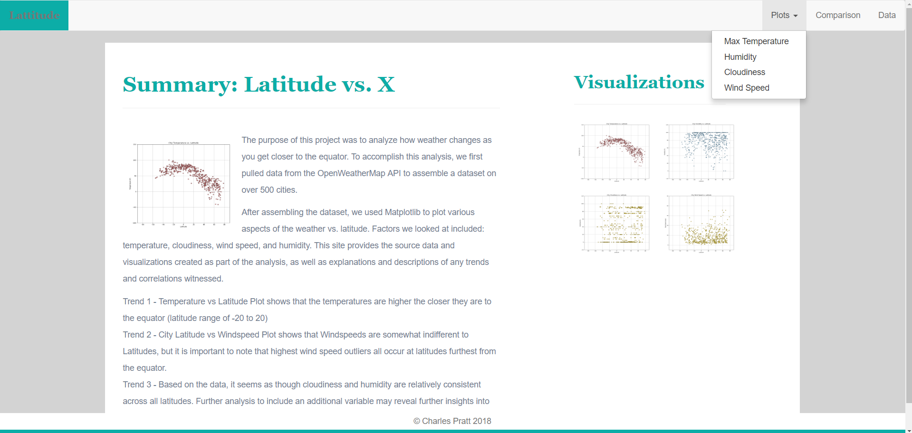

## Web Visualization Dashboard for WeatherPy Project

Created website consisting of seven pages and navigation bar to navigate between them.
- Landing page with explanations, links to each visualizations page, and observable trends
- Four visualizations pages:
  - Max Temperature
  - Humidity
  - Cloudiness
  - Windspeed
- Comparisons Page
- Data Page 

Languages and Tools:
- HTML
- CSS
- Bootstrap/Bootswatch
- ConvertCSV

https://cap015700.github.io/OpenWeatherMap-API-Web-Visualization-Dashboard/

